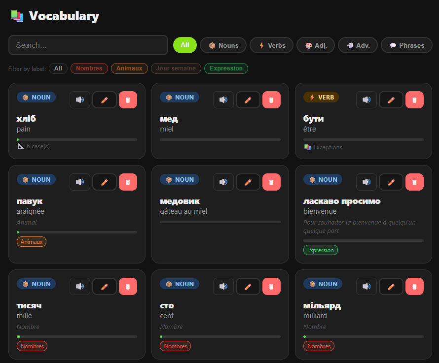

<h1>🃏 OpenFlashcards</h1>


A lightweight, modern flashcard app designed for efficient language learning, based on the words and phrases you want to learn and master — simple, fast and self-hostable.

<p align="center">
<a href="https://github.com/Liozon/OpenFlashcards/releases/latest">
  
</a>
<a href="https://hub.docker.com/r/liozon/openflashcards">
  
</a>
</p>

---

<h2>Why OpenFlashcards ?</h2>

OpenFlashcards helps you learn languages effectively with a clean interface and powerful features — without the complexity of traditional tools.

* Focus on what matters: your vocabulary, words and phrases
* Fast and responsive user experience
* Fully self-hosted, your data stays yours
* Easy deployment with Docker

---

<h2>Table of content</h2>

- [Features](#features)
- [Data structure](#data-structure)
- [Quick start (get it from Docker Hub)](#quick-start-get-it-from-docker-hub)
- [Quick start (local)](#quick-start-local)
- [Quick start (build for docker)](#quick-start-build-for-docker)
- [API Reference](#api-reference)
- [Acknowledgments](#acknowledgments)


---

## Features

* **Multi-user** with personnal authentication

<p align="center">
  
</p>

* **Admin panel** to create & manage users

<p align="center">
  
</p>

* **Per-user word banks** each user has their own words and phrases

<p align="center">
  
</p>

* **Word practice** practice words based on your word bank

<p align="center">
  
</p>

* **Phrases** practice phrase reconstruction

<p align="center">
  
</p>

* **Words writing** write words letter by letter, with TTS audio (easy mode) or without it (hard mode)

<p align="center">
  
</p>

* **Optional "Definition" field** on every word, to add context or a use case for the word

<p align="center">
  
</p>

* **Mixed practice** using filters and word types

<p align="center">
  
</p>

* **Dark mode** and responsive user interface

| Dark mode                            | Light mode                             |
| ------------------------------------ | -------------------------------------- |
|  |  |

* **Text-to-speech** via Web Speech API
* **Data stored in local JSON files** no database required and easy backup
* **Single Docker container** all in one solution

---

## Data structure

```txt
config/
  users.json                             ← All users (bcrypt-hashed passwords)

data/
  {userId}/
    config.json                          ← User prefs (languages, dark mode…)
    Words_{userId}_{langCode}.json       ← Word bank for this language
    Sentences_{userId}_{langCode}.json   ← Phrase bank for this language
```

---

## Quick start (get it from Docker Hub)

1. Download Docker Desktop: https://www.docker.com/products/docker-desktop
2. Launch **Docker Desktop**
3. In the search bar, type `liozon/openflashcards` and click on **Run**

4. Map the **container port 8000** to your **local port 8000** and click **Run**

5. Open a browser and go to **http://localhost:8000**
6. Connect to the app with the default admin credentials:
   * Username: `admin`
   * Password: `admin`
   > ⚠️ Change the default password immediately after logging in!
7. Create new users and start learning!

---

## Quick start (local)

```bash
git clone https://github.com/Liozon/OpenFlashcards.git
cd OpenFlashcards
npm install
node src/server.js
# Open http://localhost:8000
```

---

## Quick start (build for docker)

```bash
git clone https://github.com/Liozon/OpenFlashcards.git
cd OpenFlashcards
npm install
chmod +x build-and-export.sh
./build-and-export.sh
# This creates `openflashcards.tar.gz`.

docker run -d \
  --name openflashcards \
  --restart unless-stopped \
  -p 8000:8000 \
  openflashcards
# Open http://localhost:8000
```

---

## API Reference

All API routes require authentication (cookie or `Authorization: Bearer <token>`).

| Method | Path                      | Description          |
| ------ | ------------------------- | -------------------- |
| POST   | `/auth/login`             | Login                |
| POST   | `/auth/logout`            | Logout               |
| GET    | `/auth/me`                | Current user         |
| POST   | `/auth/change-password`   | Change own password  |
| GET    | `/api/config`             | Get user config      |
| PUT    | `/api/config`             | Update user config   |
| POST   | `/api/languages`          | Add a language       |
| DELETE | `/api/languages/:code`    | Remove a language    |
| GET    | `/api/words?lang=`        | List words           |
| POST   | `/api/words`              | Add word             |
| PUT    | `/api/words/:id?lang=`    | Update word          |
| DELETE | `/api/words/:id?lang=`    | Delete word          |
| GET    | `/api/phrases?lang=`      | List phrases         |
| POST   | `/api/phrases`            | Add phrase           |
| PUT    | `/api/phrases/:id?lang=`  | Update phrase        |
| DELETE | `/api/phrases/:id?lang=`  | Delete phrase        |
| GET    | `/api/quiz?lang=&types=`  | Get quiz question    |
| POST   | `/api/quiz/answer`        | Submit answer        |
| GET    | `/api/quiz/phrase?lang=`  | Get phrase quiz      |
| POST   | `/api/quiz/phrase/answer` | Submit phrase answer |
| GET    | `/api/stats?lang=`        | Get stats            |
| GET    | `/admin/users`            | List users (admin)   |
| POST   | `/admin/users`            | Create user (admin)  |
| PUT    | `/admin/users/:id`        | Update user (admin)  |
| DELETE | `/admin/users/:id`        | Delete user (admin)  |

---

## Acknowledgments

This project is based on the work of [Alex Bokos](https://github.com/alexbokos) with [open.flashcards](https://github.com/alexbokos/open.flashcards)
