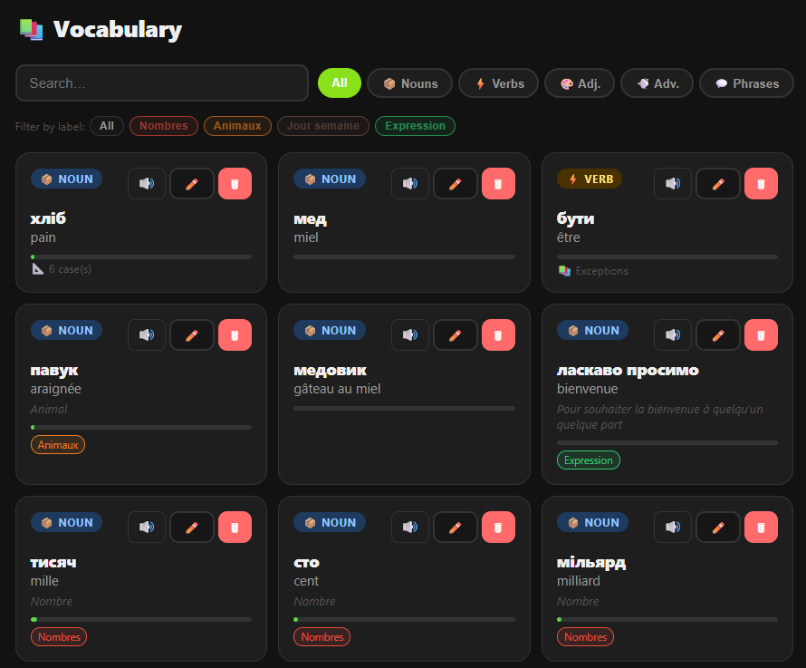

<h1> OpenFlashcards</h1>


A lightweight, modern flashcard app designed for efficient language learning, based on the words and phrases you want to learn and master — simple, fast and self-hostable with Docker.

<p align="center">
  <a href="https://github.com/Liozon/OpenFlashcards/releases/latest">
    
  </a>
  <a href="https://hub.docker.com/r/liozon/openflashcards">
    
  </a>
</p>

---

<h2>Why OpenFlashcards ?</h2>

OpenFlashcards helps you learn languages effectively with a clean interface and powerful features — without the complexity of traditional tools.

* Focus on what matters: your vocabulary, words and phrases
* Fast and responsive user experience
* Fully self-hosted, your data stays yours
* Easy deployment with Docker

---

<h2>Table of content</h2>

- [Features](#features)
- [Data structure](#data-structure)
- [Quick start (get it from Docker Hub)](#quick-start-get-it-from-docker-hub)
- [Quick start (local)](#quick-start-local)
- [Quick start (build for docker)](#quick-start-build-for-docker)
- [API Reference](#api-reference)
  - [Authentication](#authentication)
  - [Internationalization (public)](#internationalization-public)
  - [User Config \& Languages](#user-config--languages)
  - [Text-to-Speech (TTS)](#text-to-speech-tts)
  - [Words](#words)
  - [Phrases](#phrases)
  - [Quiz — Words](#quiz--words)
  - [Quiz — Phrases](#quiz--phrases)
  - [Stats](#stats)
  - [Duplicates](#duplicates)
  - [Labels](#labels)
  - [Offline](#offline)
  - [Notebook](#notebook)
  - [Vocabulary ↔ Notebook Linking](#vocabulary--notebook-linking)
  - [Admin (requires admin role)](#admin-requires-admin-role)
- [Acknowledgments](#acknowledgments)


---

## Features

* **Multi-user** with personnal authentication

<p align="center">
  
</p>

* **Admin panel** to create & manage users

<p align="center">
  
</p>

* **Per-user word banks** each user has their own words and phrases

<p align="center">
  
</p>

* **Word practice** practice words based on your word bank

<p align="center">
  
</p>

* **Phrases** practice phrase reconstruction

<p align="center">
  
</p>

* **Words writing** write words letter by letter, with TTS audio (easy mode) or without it (hard mode)

<p align="center">
  
</p>

* **Optional "Definition" field** on every word, to add context or a use case for the word

<p align="center">
  
</p>

* **Mixed practice** using filters and word types

<p align="center">
  
</p>

* **Dark mode** and responsive user interface

| Dark mode                            | Light mode                             |
| ------------------------------------ | -------------------------------------- |
|  |  |

* **Text-to-speech** via Web Speech API
* **Data stored in local JSON files** no database required and easy backup
* **Single Docker container** all in one solution

---

## Data structure

```txt
config/
  users.json                             ← All users (bcrypt-hashed passwords)

data/
  {userId}/
    config.json                          ← User prefs (languages, dark mode…)
    Words_{userId}_{langCode}.json       ← Word bank for this language
    Sentences_{userId}_{langCode}.json   ← Phrase bank for this language
```

---

## Quick start (get it from Docker Hub)

1. Download Docker Desktop: https://www.docker.com/products/docker-desktop
2. Launch **Docker Desktop**
3. In the search bar, type `liozon/openflashcards` and click on **Run**

4. Map the **container port 8000** to your **local port 8000** and click **Run**

5. Open a browser and go to **http://localhost:8000**
6. Connect to the app with the default admin credentials:
   * Username: `admin`
   * Password: `admin`
   > ⚠️ Change the default password immediately after logging in!
7. Create new users and start learning!

---

## Quick start (local)

```bash
git clone https://github.com/Liozon/OpenFlashcards.git
cd OpenFlashcards
npm install
node src/server.js
# Open http://localhost:8000
```

---

## Quick start (build for docker)

```bash
git clone https://github.com/Liozon/OpenFlashcards.git
cd OpenFlashcards
npm install
chmod +x build-and-export.sh
./build-and-export.sh
# This creates `Docker.OpenFlashcards.vlatest.tar.gz`.

docker run -d \
  --name openflashcards \
  --restart unless-stopped \
  -p 8000:8000 \
  openflashcards
# Open http://localhost:8000
```

---

## API Reference

All API routes require authentication (cookie or `Authorization: Bearer <token>`) unless marked as public.

### Authentication

| Method | Path                    | Auth | Description         |
| ------ | ----------------------- | ---- | ------------------- |
| POST   | `/auth/login`           | No   | Login               |
| POST   | `/auth/logout`          | No   | Logout              |
| GET    | `/auth/me`              | Yes  | Current user        |
| POST   | `/auth/change-password` | Yes  | Change own password |

### Internationalization (public)

| Method | Path          | Description                        |
| ------ | ------------- | ---------------------------------- |
| GET    | `/i18n/`      | List available locales             |
| GET    | `/i18n/:lang` | Get locale JSON (falls back to en) |

### User Config & Languages

| Method | Path                   | Description              |
| ------ | ---------------------- | ------------------------ |
| GET    | `/api/config`          | Get user config          |
| PUT    | `/api/config`          | Update user config       |
| POST   | `/api/languages`       | Add a language           |
| PUT    | `/api/languages/:code` | Update language settings |
| DELETE | `/api/languages/:code` | Remove a language        |

### Text-to-Speech (TTS)

| Method | Path                                   | Description                    |
| ------ | -------------------------------------- | ------------------------------ |
| GET    | `/api/tts?lang=&q=&speed=&id=`         | Stream TTS audio (cached/live) |
| GET    | `/api/tts/cache?lang=`                 | Get TTS cache stats            |
| DELETE | `/api/tts/cache/item?lang=&id=&speed=` | Delete cached TTS file         |
| DELETE | `/api/tts/cache?lang=&speed=`          | Purge TTS cache                |
| POST   | `/api/tts/generate`                    | Batch generate TTS (SSE)       |

### Words

| Method | Path                     | Description |
| ------ | ------------------------ | ----------- |
| GET    | `/api/words?lang=&type=` | List words  |
| POST   | `/api/words`             | Add word    |
| PUT    | `/api/words/:id?lang=`   | Update word |
| DELETE | `/api/words/:id?lang=`   | Delete word |

### Phrases

| Method | Path                        | Description       |
| ------ | --------------------------- | ----------------- |
| GET    | `/api/phrases?lang=`        | List phrases      |
| GET    | `/api/phrases/random?lang=` | Get random phrase |
| POST   | `/api/phrases`              | Add phrase        |
| PUT    | `/api/phrases/:id?lang=`    | Update phrase     |
| DELETE | `/api/phrases/:id?lang=`    | Delete phrase     |

### Quiz — Words

| Method | Path                             | Description        |
| ------ | -------------------------------- | ------------------ |
| GET    | `/api/quiz?lang=&types=&labels=` | Get quiz question  |
| POST   | `/api/quiz/answer`               | Submit quiz answer |

### Quiz — Phrases

| Method | Path                             | Description               |
| ------ | -------------------------------- | ------------------------- |
| GET    | `/api/quiz/phrase?lang=&labels=` | Get phrase quiz question  |
| POST   | `/api/quiz/phrase/answer`        | Submit phrase quiz answer |

### Stats

| Method | Path               | Description          |
| ------ | ------------------ | -------------------- |
| GET    | `/api/stats?lang=` | Get vocabulary stats |

### Duplicates

| Method | Path                    | Description                  |
| ------ | ----------------------- | ---------------------------- |
| POST   | `/api/duplicates`       | Find duplicate words/phrases |
| POST   | `/api/duplicates/merge` | Merge duplicate groups       |

### Labels

| Method | Path                    | Description                |
| ------ | ----------------------- | -------------------------- |
| GET    | `/api/labels?lang=`     | List labels for a language |
| POST   | `/api/labels`           | Create a label             |
| PUT    | `/api/labels/:id?lang=` | Rename / recolor a label   |
| DELETE | `/api/labels/:id?lang=` | Delete a label             |

### Offline

| Method | Path                                       | Description                |
| ------ | ------------------------------------------ | -------------------------- |
| GET    | `/api/offline/bundle?langs=`               | Get offline data bundle    |
| POST   | `/api/offline/sync`                        | Sync queued offline writes |
| POST   | `/api/progress/sync`                       | Sync offline quiz progress |
| PUT    | `/api/offline/settings`                    | Toggle offline mode        |
| GET    | `/api/offline/tts-manifest?lang=`          | List cached TTS files      |
| GET    | `/api/offline/tts/:lang/:speedKey/:itemId` | Serve cached TTS MP3       |
| GET    | `/api/offline/tts-status?lang=`            | TTS cache status           |

### Notebook

| Method | Path                                            | Description              |
| ------ | ----------------------------------------------- | ------------------------ |
| GET    | `/api/notebook/:code`                           | Get full notebook        |
| PUT    | `/api/notebook/:code`                           | Save full notebook       |
| POST   | `/api/notebook/:code/sections`                  | Create section           |
| PUT    | `/api/notebook/:code/sections/:sectionId`       | Rename / reorder section |
| DELETE | `/api/notebook/:code/sections/:sectionId`       | Delete section           |
| POST   | `/api/notebook/:code/sections/:sectionId/pages` | Create page              |
| PUT    | `/api/notebook/:code/pages/:pageId`             | Update page              |
| POST   | `/api/notebook/:code/pages/:pageId/duplicate`   | Duplicate page           |
| DELETE | `/api/notebook/:code/pages/:pageId`             | Delete page              |
| GET    | `/api/notebook/:code/search?q=`                 | Search notebook pages    |
| POST   | `/api/notebook/:code/images`                    | Upload notebook image    |
| DELETE | `/api/notebook/:code/images/:filename`          | Delete notebook image    |
| GET    | `/api/notebook/:code/images/:filename`          | Serve notebook image     |

### Vocabulary ↔ Notebook Linking

| Method | Path              | Description                           |
| ------ | ----------------- | ------------------------------------- |
| POST   | `/api/vocab-link` | Link vocabulary item to notebook page |
| DELETE | `/api/vocab-link` | Remove vocabulary–notebook link       |

### Admin (requires admin role)

| Method | Path                                  | Description                    |
| ------ | ------------------------------------- | ------------------------------ |
| GET    | `/admin/users`                        | List users                     |
| POST   | `/admin/users`                        | Create user                    |
| PUT    | `/admin/users/:id`                    | Update user (password / role)  |
| DELETE | `/admin/users/:id`                    | Delete user                    |
| PUT    | `/admin/users/:id/tts-cache-default`  | Toggle TTS cache default       |
| GET    | `/admin/users/:id/tts-cache/stats`    | TTS cache disk usage           |
| GET    | `/admin/users/:id/tts-cache/count`    | Count items for TTS generation |
| DELETE | `/admin/users/:id/tts-cache`          | Purge TTS cache for user       |
| POST   | `/admin/users/:id/tts-cache/generate` | Generate full TTS cache (SSE)  |

---

## Acknowledgments

This project is based on the work of [Alex Bokos](https://github.com/alexbokos) with [open.flashcards](https://github.com/alexbokos/open.flashcards)
